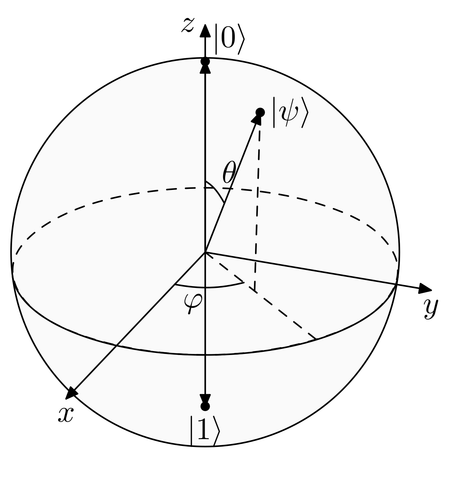

# Lecture 1.1 - Vector Spaces, Tensor Products, and Qubits

> Source: https://www.youtube.com/watch?v=xgA4Dx_7q34&list=PLOFEBzvs-VvqJwybFxkTiDzhf5E11p8BI

# 1. From Bits to Qubits

- Classical states for computation are either "0" or "1".
- In quantum machanics, a state can be in *superposition*, i.e, simultaneously be in "0" and "1".
- Superpositions allow to perform calculations on many states at the same time. 

$\implies$ Quantum algorithms with exponential speed-up.

**BUT**: Once we measure the superposition state, it sollapses into one of its states.

It is not THAT easy to design quantum algorithms, but we use **interference effects**.

## 1.1. Dirac notation & density matrices

- Used to describe quantum states. Let $a, b \in \mathbb{C}^2$.
    - Ket: $|a \rangle= \begin{pmatrix} a_0 \\ a_1 \end{pmatrix}$.
    - Bra: $\langle b| = |b \rangle ^ \dagger = \begin{pmatrix} b_0 \\ b_1 \end{pmatrix}^\dagger = \begin{pmatrix} b_0^* & b_1^* \end{pmatrix}$.
    - Bra-Ket (Inner Product): $\langle b|a \rangle = a_0b_0^* + a_1b_1^* = \langle a|b \rangle^* \in \mathbb{C}$.
    - Ket-Bra (Outer Product): $|a\rangle\langle b| = \begin{pmatrix} a_0b_0^* & a_0b_1^* \\ a_1b_0^* & a_1b_1^* \end{pmatrix}$.
- We define the pure state $|0 \rangle = \begin{pmatrix} 1 \\ 0 \end{pmatrix}$  and $|1 \rangle = \begin{pmatrix} 0 \\ 1 \end{pmatrix}$, which are orthogonal: $\langle 0 | 1 \rangle = 1.0 + 0.1=0$.

$|0 \rangle \langle 0 | = \begin{pmatrix} 1 & 0 \end{pmatrix} \begin{pmatrix} 1 \\ 0 \end{pmatrix} = \begin{pmatrix} 1 & 0 \\ 0 & 0 \end{pmatrix}$

$|1 \rangle \langle 1 | = \begin{pmatrix} 0 & 1 \end{pmatrix} \begin{pmatrix} 0 \\ 1 \end{pmatrix} = \begin{pmatrix} 0 & 0 \\ 0 & 1 \end{pmatrix}$

$\implies \rho = \begin{pmatrix} \rho_{00} & \rho_{01} \\ \rho_{10} & \rho_{11} \end{pmatrix} = \rho_{00} |0 \rangle \langle 0| + \rho_{01} |0 \rangle \langle1| + \rho_{10} |1 \rangle \langle 0| + \rho_{11} |1 \rangle \langle1|$.

- All quantum states can be described by **density matrices**, i.e, normalized positive Hermitian operators $\rho :tr(\rho)=1, \rho \ge 0, \rho=\rho^\dagger$.

$tr(\rho)=\rho_{00} + \rho_{11} = 1,\langle \psi | \rho | \psi\rangle\ge0 \ \forall \ \psi$, all aigenvalues $\ge0$ 

$\rho^\dagger = \begin{pmatrix} \rho_{00}^* & \rho_{01}^* \\ \rho_{10}^* & \rho_{11}^* \end{pmatrix} = \rho$

- All quantum states are normalized, i.e, $\langle\psi|\psi\rangle=1$, e.g, $|\psi\rangle=\frac{1}{\sqrt{2}}(|0\rangle + |1\rangle) = \begin{pmatrix} \frac{1}{\sqrt{2}} \\ \frac{1}{\sqrt{2}} \end{pmatrix}$.

- **Spectral Decomposition**: For every density matrix $\rho$ exists an orthonormal basis $\set{|i\rangle}$, s.t. $\rho=\sum\limits_{i}=\lambda_i|i\rangle\langle i|$. Where:
  - $|i\rangle$: eigenstates.
  - $\lambda_i$: eigenvalues.
  - $\sum\limits_{i}\lambda_i=1$.
- A density matrix is **pure** if $\rho=|\psi\rangle\langle\psi |$, otherwise it is called **mixed**.
  - If $\rho$ is pure, one eigenvalue is 1, all others are 0, i.e. $tr(\rho^2)=\sum\limits_{i}\lambda_{i}^2=1$ if $\rho$ is pure, otherwise $tr(\rho^2) < 1$.

Example: 
- (i) $\rho=\begin{pmatrix} 1 & 0 \\ 0 & 0 \end{pmatrix} = |0\rangle\langle0| \implies$ pure.
- (ii) $\rho=\begin{pmatrix} 0 & 0 \\ 0 & 1 \end{pmatrix} = |1\rangle\langle1| \implies$ pure.
- (iii) $\rho=\frac{1}{2}\begin{pmatrix} 1 & 0 \\ 0 & 1 \end{pmatrix}=\frac{1}{2}(|0\rangle\langle0| + |1\rangle\langle1|) \implies tr(\rho^2)=\sum\limits_{i}\lambda_i^2= \left(\frac{1}{2}\right)^2+\left(\frac{1}{2}\right)^2<1 \implies$ mixed.
- (iv) $\rho=\frac{1}{2}\begin{pmatrix} 1 & -1 \\ -1 & 1 \end{pmatrix}=\frac{1}{2}(|0\rangle\langle0| - |0\rangle\langle1| - |1\rangle\langle0| + |1\rangle\langle1|) = \underbrace{\frac{1}{\sqrt{2}}\left(|0\rangle - |1\rangle\right)}_{|\psi\rangle} \underbrace{\left(\langle 0| - \langle 1|\right)\frac{1}{\sqrt{2}}}_{\langle\psi|} \implies$ pure.

## 1.2. Measurements

- We choose orthogonal bases to describe measure quantum states.
- During a measurement onto the basis $\set{|0\rangle, |1\rangle}$, the state will *collapse* into either state $|0\rangle$ or $|1\rangle$. As these are the two eigenstates of $\sigma_z=\begin{pmatrix} 1 & 0 \\ 0 & -1 \end{pmatrix}$, we call this a Z-measurement.
- There are infinitely many different basises, but other common one are $\set{|+\rangle\coloneqq\frac{1}{\sqrt{2}}(|0\rangle + |1\rangle), |-\rangle\coloneqq\frac{1}{\sqrt{2}}(|0\rangle - |1\rangle)}$ and $\set{|+i\rangle\coloneqq\frac{1}{\sqrt{2}}(|0\rangle + i|1\rangle), |-i\rangle\coloneqq\frac{1}{\sqrt{2}}(|0\rangle - i|1\rangle)}$, corresponding to the eigensates of $\sigma_x$ and $\sigma_y$ respectively.

**Born rule**: The probability that a state $\psi$ collapses during a projective measurement onto the basis $\set{|x\rangle, |x^\dagger\rangle}$ to the state $|x\rangle$ is given by $P(x)=|\langle x|\psi\rangle|^2, \ \sum\limits_{i}P(x_i)=1$.

Examples: 
- $|\psi\rangle=\frac{1}{\sqrt{3}}(|0\rangle + \sqrt{2}|1\rangle)$ is measure in the basis $\set{|0\rangle, \ |1\rangle}$

    $P(0)=\left|\left\langle 0 \middle| \frac{1}{\sqrt{3}}\left(|0\rangle + \sqrt{2}|1\rangle\right) \right\rangle \right|^2 = \left| \frac{1}{\sqrt{3}}\underbrace{\langle 0 | 0 \rangle}_{1} + \sqrt{\frac{2}{3}} \underbrace{\langle 0 | 1\rangle}_{0} \right|^2 = \frac{1}{3} \implies P(1)=\frac{2}{3}$.   

- $|\psi\rangle = \frac{1}{\sqrt{2}}(|0\rangle - |1\rangle)$ is measure in the basis $\set{|+\rangle, \ |-\rangle}$
  
    $P(+) = \left| \langle+|\psi\rangle \right|^2 = \left| \left\langle \frac{1}{\sqrt{2}} (\langle0| + \langle1|) \middle| \frac{1}{\sqrt{2}}(|0\rangle - |1\rangle) \right\rangle \right|^2 = \frac{1}{4} \left| \underbrace{\langle0|0\rangle}_{1} - \underbrace{\langle0|1\rangle}_{0} + \underbrace{\langle1|0\rangle}_{0} - \underbrace{\langle1|1\rangle}_{1} \right|^2 = 0$.

    $\implies$ Expected as $\langle + | \psi\rangle = \langle +|- \rangle = 0 \implies P(-) = \left| \langle-|-\rangle \right|^2 = 1$.

## 1.3. Bloch Sphere

<figure>
  
  <figcaption align="center">Fig 1. Bloch Sphere Representation</figcaption>
</figure>

- We can write any normalized pure state as $|\psi\rangle = \cos\frac{\theta}{2}|0\rangle + e^{i\varphi}\sin\frac{\theta}{2}|1\rangle$ where $\varphi \in [0, 2\pi)$ describes the relative phase and $\theta\in[0,\pi]$ determines the probability to measure $|0\rangle$ or $|1\rangle$:
    
    $P(0) = \cos^2\frac{\theta}{2}$ \
    $P(1) = \sin^2\frac{\theta}{2}$

- All normalized pure states can be illustrate them on the surface of a sphere with radius $|\vec{r}|=1$, which we call the **Bloch Sphere**.
- The coordinates of such a state are given by the **Bloch vector**: $\vec{r}=\begin{pmatrix} \sin\theta \cos\varphi \\ \sin\theta \sin\varphi \\ \cos\theta \end{pmatrix}$.

Examples: 

- $|0\rangle: \theta=0, \ \varphi$ arbitrary $\implies \vec{r}=\begin{pmatrix} 0 \\ 0 \\ 1 \end{pmatrix}$.
- $|1\rangle: \theta=\pi, \ \varphi$ arbitrary $\implies \vec{r}=\begin{pmatrix} 0 \\ 0 \\ -1 \end{pmatrix}$.
- $|+\rangle: \theta=\frac{\pi}{2}, \ \varphi=0 \implies \vec{r}=\begin{pmatrix} 1 \\ 0 \\ 0 \end{pmatrix}$.
- $|-\rangle: \theta=\frac{\pi}{2}, \ \varphi=\pi \implies \vec{r}=\begin{pmatrix} -1 \\ 0 \\ 0 \end{pmatrix}$.
- $|+i\rangle: \theta=\frac{\pi}{2}, \ \varphi=\frac{\pi}{2} \implies \vec{r}=\begin{pmatrix} 0 \\ 1 \\ 0 \end{pmatrix}$.
- $|-i\rangle: \theta=\frac{\pi}{2}, \ \varphi=\frac{3\pi}{2} \implies \vec{r}=\begin{pmatrix} 0 \\ -1 \\ 0 \end{pmatrix}$.

**BE CAREFUL**: 
- On the Bloch Sphere, angles are *twice* as large as they are in Hilbert space, e.g. $|0\rangle$ and $|1\rangle$ are orthogonal, but on the Bloch sphere, their angle is $180^\circ$.
- For a general state $|\psi\rangle=\cos\frac{\theta}{2}|0\rangle + e^{i\varphi}\sin\frac{\theta}{2}|1\rangle$, $\theta$ is the angle on the Bloch sphere while $\frac{\theta}{2}$ is the actual angle in Hilbert space.